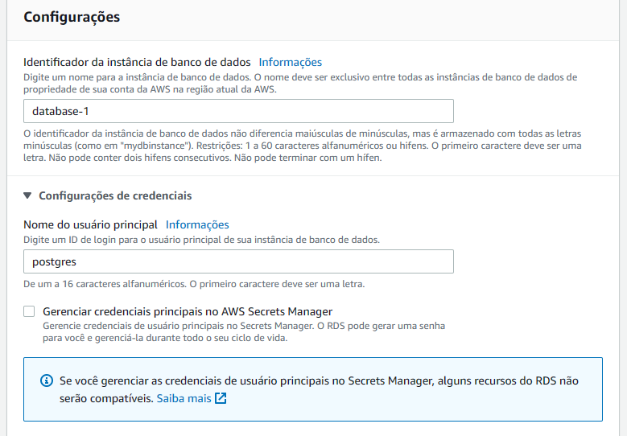

# Introdução a bancos de dados

&nbsp;

## O que é um banco de dados?

Um banco de dados é uma coleção de dados. 

**Dados** são fatos conhecidos que podem ser registrados e possuem significado implícito.

Se transcrevermos essa aula, teremos um banco de dados relacionados ou não?

&nbsp;

> Sim, temos.

&nbsp;

Porém, o uso comum do termo **banco de dados** normalmente é mais restritivo, e possui algumas propriedades implíticas, como por exemplo:

- Um banco de dados representa algum aspecto do mundo real (o chamado universo de discurso - UoD, do termo em inglês). As mudanças no UoD são refletidas no banco de dados.
- Um banco de dados é uma coleção lógica coerente de dados com algum significado. Uma variedade aleatória de dados não pode ser corretamente chamada de banco de dados.
- Um banco de dados é projetado, construído e populado com dados para uma finalidade específica. Ele possui um grupo definido de usuários e algumas aplicações previamente concebidas nas quais esses usuários estão interessados.

&nbsp;

Em outras palavras, um banco de dados tem alguma fonte da qual o dado é derivado, algum grau de interação com eventos no mundo real e um público que está ativamente interessado no seu conteúdo.

Ou ainda,

> Um banco de dados é uma estrutura organizada na qual se pode armazenar dados de forma estruturada, podendo ser facilmente consultado a qualquer momento, por um programa ou pessoa, permitindo extrair informações.

&nbsp;

## O que são SGBDs?

E como manipulamos os dados de um banco de dados?

Para **definir**, **construir**, **manipular** e **compartilhar** bancos de dados nós utilizamos os Sistemas Gerenciadores de Bancos de dados, os populares SGBDs. Com certeza vocês já ouviram falar de 1 ou + deles. SQL Management Studio, PGAdmin, DBeaver, entre outros.

- **Definir** um banco de dados envolve especificar os tipos, estruturas e restrições dos dados a serem armazenados.

- **Construir** o banco de dados é o processo de armazenar os dados em algum meio controlado pelo SGBD (ou seja, nos arquivos internos dele).

- **Manipular** o banco de dados inclui funções como consultas para recuperar dados, atualizações dos dados e a geração de relatórios com esses dados armazenados.

- **Compartilhar** o banco de dados envolve permitir tanto que programas quanto usuários acessem ele simultaneamente.

Em suma, um SGBD é um programa especializado e utilizado para manipular bancos de dados.

&nbsp;

## Antes dos SGBDs

Com sorte, dados anotados em algum lugar.

Sem sorte, sem controle.

&nbsp;

**Depois dos computadores:**

Arquivos de texto simples, armazenados em um computador ou mainframe de acordo com uma hierarquia ou não, dependendo do sistema.

Funcional, mas com limitações de **crescimento** e **redundância**

- **Crescimento:** Dividir em novos arquivos

- **Redundânca:** Replicar os arquivos

&nbsp;

## Benefícios de usar um SGBD?

- **Armazenamento estruturado**: Os SGBDs provém uma forma estruturada de organizar e armazenar grandes quantidades de dados.

- **Controle de concorrência**: Os SGBDs possuem mecanismos para que diversos usuários manipulem os dados ao mesmo tempo, sem causar conflitos ou corrupção dos dados.

- **Consistência e integridade**: Os SGBDs possuem mecanismos para garantir que os dados estão consistentes e corretos, além de prevenir contra corrupção ou perda dos dados.

- **Segurança**: Os SGBDs possuem mecanismos para autorizar e/ou bloquear o acesso aos dados.

- **Backup e recuperação**: Os SGBDs possuem mecanismos para realizar o backup e a recuperação dos dados em caso de desastre ou falhas.

- **Manipulação dos dados**: Os SGBDs fornecem mecanismos de pesquisa e manipulação dos dados de forma simplificada.

- **Escalabilidade e performance**: Os SGBDs são desenhados para que os bancos de dados possam escalar horizontalmente ou verticalmente, além de proverem mecanismos de otimização da performance a medida que o banco de dados cresce.

&nbsp;

## Controle de concorrência e transações

Considerem o seguinte cenário. Vocês vão viajar de avião para curtir as férias, e para isso entram no site da companhia aérea e reservam uma poltrona. Quando chegam no aeroporto, no dia da viagem, a comissária que controla o embarque diz que vocês não podem embarcar, porque a pessoa que ia utilizar o assento marcado na passagem de vocês já embarcou. Por que isso aconteceu?

&nbsp;

> O sistema da companhia aérea não controlou corretamente a transação, e permitiu que duas pessoas reservassem o mesmo assento simultaneamente. Mas o que é uma transação?

&nbsp;

Uma transação é um *programa em execução* ou um *processo* que inclui um ou mais acessos ao banco de dados, como a leitura ou atualização dos registros.

Para garantir a execução de uma transação corretamente: **propriedades ACID**

&nbsp;

## Propriedades ACID
As propriedades ACID são propriedades impostas pelos SGBDs para garantir o controle de concorrência e recuperação dos dados em eventuais falhas. ACID é um acrônimo para **Atomicidade**, **Preservação da Consistência**, **Isolamento** e **Durabilidade (ou persistência)**.

- **Atomicidade**: Refere-se a habilidade do SGBD de tratar a transação como uma unidade única e indivisível de trabalho. Como quando pensávamos que os átomos eram a menor unidade indivisível da matéria. Isso significa que ou **todas** as mudanças programadas para a transação são comitadas no banco de dados, ou **nenhuma** delas é commitada. Não tem meio termo. Isso garante que o banco de dados se mantenha consistente, mesmo em caso de falha ou outros problemas.

- **Consistência**: Um banco de dados deve sempre estar em um estado válido (funcional, sem dados corrompidos, com os dados atualizados e corretos em um determinado ponto no tempo, etc). Isso significa que qualquer transação que seja executada no banco de dados deve levar ele de um estado válido para outro estado válido. A consistência garante que o banco de dados esteja sempre atualizado com os dados corretos, refletindo o atual estado do negócio ou da organização.

- **Isolamento**: Cada transação em execução no sistema deve ocorrer isolada (sem interferência) das outras transações que estão em execução ao mesmo tempo. Isso garante que uma transação execute no banco de dados como se fosse a única transação em execução em um determinado momento. O isolamento previne problemas como *deadlocks* e *race conditions* (quando duas transações tentam acessar e modificar os mesmos dados).

- **Durabilidade**: Uma vez que a transação tenha sido comitada no banco de dados, ela deve ser permanente e sobreviver (ou persistir) a quaisquer falhas, *crashes*, quedas de energia ou problemas inesperados no banco de dados.

&nbsp;

## SQL x noSQL x newSQL

**NoSQL**: Bancos de dados não relacionais, e o nome NoSQL vem de **Not only SQL**, pois podem ser utilizados com outras linguagens (normalmente próprias do banco de dados ou APIs) que não o SQL. Ex: MongoDB, AWS Dynamo DB, Cosmos DB

**SQL**: Bancos relacionais, que utilizam a linguagem SQL para manipulações. Ex: Oracle SQL, PostgreSQL, SQL Server

**NewSQL** Bancos de dados relacionais modernos que buscam fornecer a escalabilidade e performance dos bancos noSQL enquanto mantém as propriedades ACID dos bancos relacionais tradicionais para prover a consistência, durabilidade e confiabilidade no BD. Utilizam SQL. Ex: VoltDB, Clustrix, MemSQL, Google Spanner

&nbsp;

## PostgreSQL

- É um banco de dados Open Source, ou seja, vocês podem instalar, configurar e modificar ele livremente sem precisar pagar licenças. O Redshift e o Aurora da Amazon, por exemplo, rodam modificações do PostgreSQL.
- É estável e robusto, podendo rodar por anos sem problemas
- Possui suporte a JSON e outros dados semi estruturados, além de tipos diferentes de dados (por exemplo, períodos de range de datas, que são especialmente úteis para agendamentos de hotéis, reservas, etc), além de seguir as propriedades ACID.
- É altamente escalável, o que permite suportar quantidades enormes de dados e tráfego.
- Possui suporte da comunidade, desenvolvendo novas features e ajudando quem precisa tanto com suporte técnico quando compartilhando conhecimento.

&nbsp;

## Instale seu próprio banco de dados
A forma mais usual, antes de existirem os containers, era instalar o banco de dados na nossa máquina local. 
- **Vantagem:** Desenvolvimento facilitado, pois não precisa pedir dados ao admin do BD, etc.
- **Desvantagem:** Sobrecarrega a máquina local (instalar SQL Server, Oracle SQL, PostgreSQL, etc)

&nbsp;

## Rodando o banco de dados com containers
Processo mais simplificado. Basta subir o container.

> **Atenção**
>
> Subir o banco de dados em um container **não** salva os dados. 
> 
> É necessário configurar um volume para persistir os dados localmente.

&nbsp;

Para subir o container com Postgres, executem os passos abaixo:

Passo 1:
- Instalar docker no Windows: https://docs.docker.com/desktop/install/windows-install/

- Instalar docker no Linux: https://docs.docker.com/desktop/install/linux-install/

- Instalar docker no Mac: https://docs.docker.com/desktop/install/mac-install/
  
Passo 2:
Baixar a imagem do docker, utilizando o terminal do windows
```bash
docker pull postgres
```

Passo 3:
Rodar o docker
```bash
docker run --name myPostgresDb -p 5455:5432 -e POSTGRES_USER=postgresUser -e POSTGRES_PASSWORD=postgresPW -e POSTGRES_DB=postgresDB -v ${PWD}/postgres-docker:/var/lib/postgresql/data -d postgres
```

Onde:

- `docker run` é o comando usado para criar e rodar o container a partir da imagem baixada
- `--name myPostgresDb` é o nome do container
- `-p 5455:5432` é o mapeamento das portas. Normalmente o postgres expõe a porta 5432 para conexão (dentro do container), e precisamos mapear essa porta para uma local do computador. Nesse caso, escolhemos a porta 5455, mas poderia ser outra.
- `-e POSTGRES_USER=postgresUser, -e POSTGRES_PASSWORD=postgresPW, -e POSTGRES_DB=postgresDB` são as variáveis de ambiente configuradas nesse container. Estamos definindo o username, a senha e o nome do banco de dados no container.
- `-v` indica o volume (o diretório na máquina local) em que os dados serão armazenados. `${PWD}/postgres-docker` é na pasta postgres-docker, dentro do diretório atual que estamos rodando, e o caminho `/var/lib/postgresql/data` corresponde a dentro do container, onde os dados seriam armazenados
- `-d` indica que estamos rodando o container em background, no chamado *detached mode*
- `postgres` é a imagem que estamos usando pra rodar o container.

Caso esquecam as variáveis de ambiente que utilizaram, podem usar o comando `docker exec myPostgresDb env` para ver elas novamente.

&nbsp;

## Rodando o banco de dados em cloud
Existem provedores, como a AWS, que fornecem um período *free tier* nas suas plataformas. Caso vocês ainda tenham esse período na AWS, podem subir o banco de dados lá, e conectar através de um dos gerenciadores de SGBDs do PostgreSQL, o PGAdmin ou o DBeaver.

O passo a passo para criar um banco de dados na AWS pode ser visto aqui.


>**ATENÇÃO**
>
> Não nos responsabilizamos pelos custos que podem ocorrer realizando a criação através dos passos abaixo.

&nbsp;


Clicar em "Criar banco de dados"

&nbsp;


Definir a criação padrão e o banco PostgreSQL

&nbsp;


Selecionar o nível gratuito

&nbsp;


Definir os dados solicitados

&nbsp;


Definir os dados solicitados

&nbsp;


Definir os dados solicitados

&nbsp;


Marcar as opções acima (obs: o código do VPC pode ser diferente do da imagem)

&nbsp; 


Definir os dados solicitados

&nbsp;


Definir os dados solicitados

&nbsp;


Definir os dados solicitados

&nbsp;


Definir os dados solicitados

&nbsp;


Definir os dados solicitados

&nbsp;


Definir os dados solicitados

&nbsp;


Definir os dados solicitados

&nbsp;

Depois, para conectar, podem utilizar o PGAdmin ou o DBeaver utilizando o usuário e a senha que vocês definiram na página da AWS.


&nbsp;

## Conectando em um banco de dados remoto
PGAdmin 

DBeaver

## Exercícios
- Instalar o PGAdmin 4
- Rever a parte da aula de conexão no banco de dados.